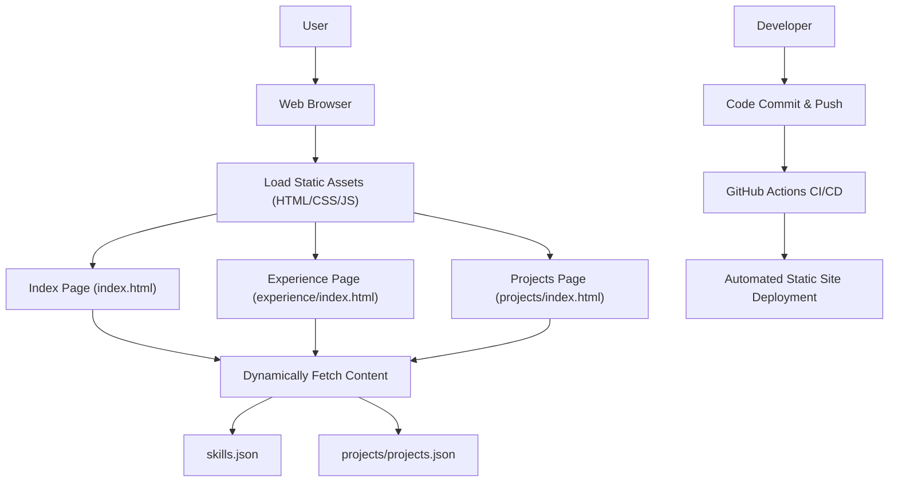

# 🚀 Dynamic Developer Portfolio Website

<p align="center"></p>

## Short Description
Unveil your professional journey with this sleek, modern, and highly interactive personal portfolio website. Crafted to make an immediate impact, it dynamically showcases your projects, highlights your skills, details your experience, and provides a seamless platform for recruiters and collaborators to discover your talent. With a focus on performance and engaging design, this template ensures your online presence is as impressive as your work.

## ✨ Key Features
*   **Dynamic Project Showcase**: Easily manage and display your impressive projects using `projects.json` for effortless updates and a rich visual experience.
*   **Interactive Skills Section**: Highlight your technical expertise with a dedicated, data-driven skills section powered by `skills.json`.
*   **Comprehensive Experience Timeline**: Present your professional history in a clear, engaging, and structured format.
*   **Seamless CV/Resume Integration**: Direct access to your resume via `assests/resume.pdf` for quick review by potential employers.
*   **Automated CI/CD Workflow**: Leverage GitHub Actions for continuous integration and deployment, ensuring your portfolio is always up-to-date and accessible.
*   **Elegant & Responsive Design**: A pixel-perfect, mobile-first design that adapts beautifully across all devices, ensuring a consistent user experience.
*   **Custom 404 Page**: A polished, branded error page enhances user experience even when navigating off the beaten path.
*   **Interactive Background Effects**: Engaging visual elements, powered by `particles.min.js`, add a modern and dynamic feel.

## Who is this for?
This portfolio is ideal for:
*   **Aspiring Developers & Seasoned Engineers**: Showcase your technical prowess and project contributions.
*   **Recruiters & Hiring Managers**: Quickly assess candidates' skills, experience, and project work.
*   **Collaborators**: Find partners for your next great idea by presenting your capabilities.
*   **Anyone seeking a professional online presence**: A robust yet simple platform to articulate your career narrative.

## Technology Stack & Architecture
This portfolio is built on a robust and widely adopted stack, ensuring maintainability, performance, and ease of deployment:

*   **Frontend**: HTML5, CSS3, JavaScript
*   **Dynamic Content**: JSON (for `projects.json` and `skills.json`)
*   **Interactivity**: Vanilla JavaScript with libraries like `particles.min.js` for visual flair.
*   **Deployment**: Static Site Hosting
*   **Automation**: GitHub Actions (for CI/CD)

## 📊 Architecture & Database Schema
This project leverages a client-side architecture without a traditional backend database. Content is dynamically loaded from local JSON files, enabling a fast, secure, and easily deployable static website.



## ⚡ Quick Start Guide
Get your personalized portfolio up and running in no time!

1.  **Clone the Repository:**
    ```bash
    git clone https://github.com/ambikeshkathula23-cmd/portfolio_website.git
    cd portfolio_website
    ```

2.  **View Locally:**
    Since this is a static site, you can simply open `index.html` in your web browser. For a more production-like environment, you can use a simple local server:
    ```bash
    # For Python 3
    python -m http.server 8000
    ```
    Then, navigate to `http://localhost:8000` in your browser.

3.  **Customize Your Content:**
    *   Edit `projects/projects.json` to add or update your project details.
    *   Modify `skills.json` to reflect your technical skillset.
    *   Update `assests/resume.pdf` with your latest CV.
    *   Personalize `index.html`, `experience/index.html`, and `projects/index.html` with your personal information and details.

4.  **Deploy (Optional):**
    The `.github/workflows/ci-cd.yml` file is configured for automated deployment via GitHub Actions. Push your changes to GitHub, and the workflow will handle deployment to your desired static hosting provider (e.g., GitHub Pages, Vercel, Netlify).

## 📜 License
This project is licensed under the terms of the LICENSE file.